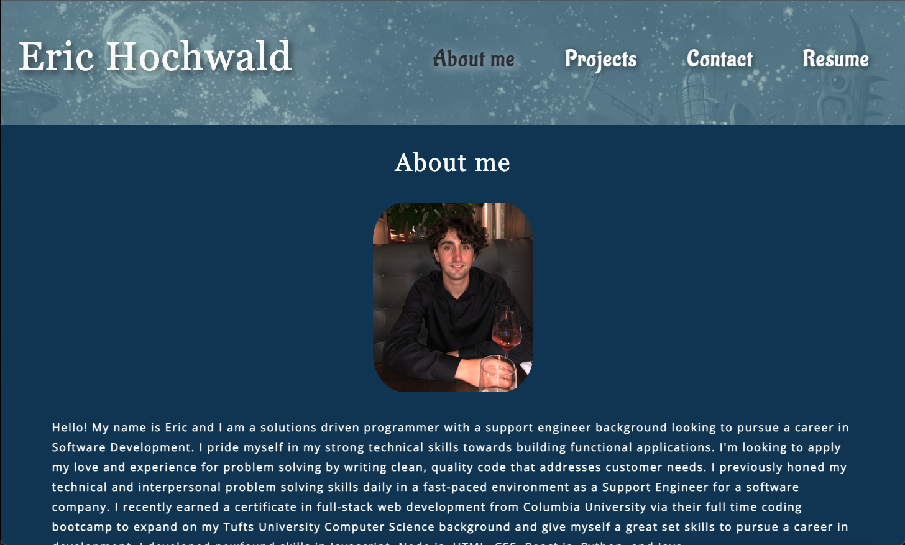

# Eric Hochwald's Programming Portfolio
* [Link](#link)
* [Description](#description)
* [Technologies](#technologies)
* [Screenshots](#screenshots)

## Link 
[Github Pages Deployment](https://ehochw01.github.io/react-portfolio/)

## Description
```
This is my professional programming portfolio. It was built using React.js and CSS. I purposely avoided Bootstrap and other CSS frameworks for this in order to get some practice with raw CSS. It contains an About page, a Projects page with a list of Projects and links to see them, a Contact Page, and a Resume page.

To view my portfolio, please click the link above. 
```

## Technologies
`
- React.js
- CSS
`

## Sceenshots
About Page:



Projects Page:


Contact Page:


Resume Page:


